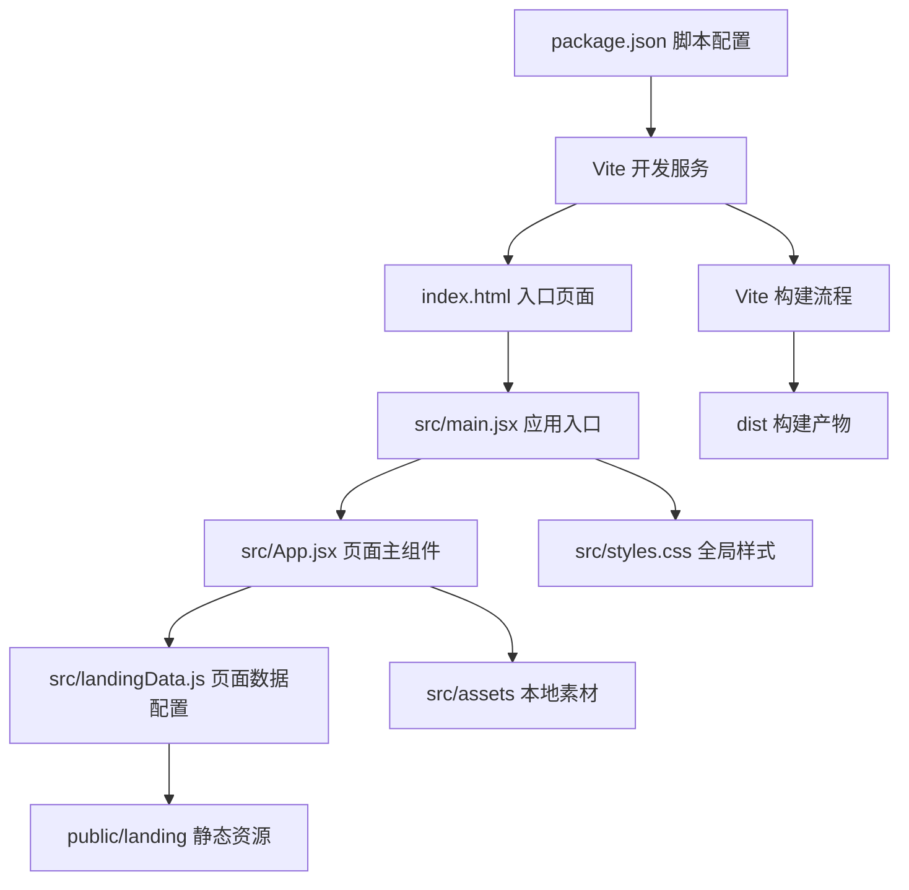
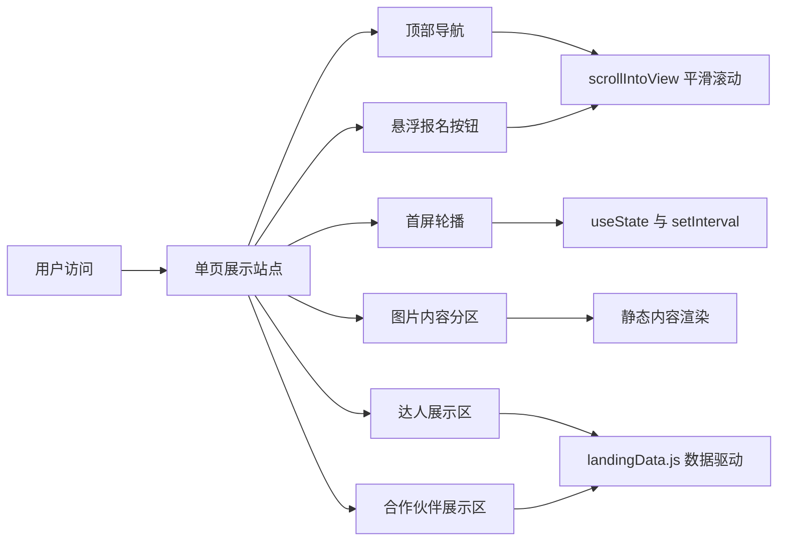

# 项目技术架构与目录结构

## 技术栈

- 构建工具：Vite 7
- 前端框架：React 19
- 渲染层：React DOM 19
- 路由依赖：React Router DOM 7（已安装，当前代码中未实际使用）
- 开发语言：JavaScript + JSX
- 样式方案：原生 CSS
- 资源管理：`public/landing` 静态资源 + `src/assets` 本地图片资源

## 技术架构图



## 运行结构图



## 目录结构图

```text
web/
|-- dist/                    # Vite 构建输出目录
|-- node_modules/            # 已安装依赖
|-- public/
|   |-- favicon.ico
|   |-- favicon.svg
|   `-- landing/             # 主要静态图片与设计资源目录
|       |-- 01首屏/
|       |-- 大会介绍/
|       |-- 大会设计/
|       |-- 展会亮点/
|       |-- 展会内容/
|       |-- 拟邀请达人/
|       |-- 立即报名/
|       |-- 行业首创/
|       `-- *.jpg/*.svg
|-- src/
|   |-- assets/              # 本地直接导入的图片资源
|   |   |-- exact/
|   |   |-- sections/
|   |   |-- sections-exact/
|   |   `-- speakers/
|   |-- App.jsx              # 页面主组件
|   |-- landingData.js       # 页面数据与资源路径映射
|   |-- main.jsx             # React 应用入口
|   `-- styles.css           # 全局样式文件
|-- index.html               # Vite HTML 入口
|-- package.json             # 依赖与脚本配置
|-- package-lock.json        # npm 锁定文件
`-- vite.config.js           # Vite 配置文件
```

## 代码职责说明

- `index.html`：提供根节点容器，并加载 `/src/main.jsx`
- `src/main.jsx`：挂载 React 应用，并引入全局样式
- `src/App.jsx`：承载整个落地页的页面结构与交互逻辑
- `src/landingData.js`：集中管理导航项、页面数据和静态资源路径
- `src/styles.css`：控制布局、响应式、动画和整体视觉样式
- `public/landing`：存放通过 URL 访问的大型静态设计资源
- `src/assets`：存放在 React 中直接导入使用的图片素材

## 当前工程特征

- 这是一个偏品牌展示 / 活动官网类型的轻量级单页应用
- 当前项目主要依赖 React 组件状态和浏览器原生 API 实现交互，没有引入状态管理库
- 项目暂未接入 TypeScript、测试框架、Lint 规范配置或 UI 组件库
- 页面导航基于锚点滚动实现，而不是基于路由切换实现
